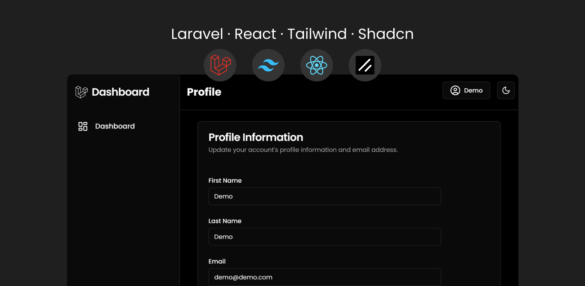

# Dashboard Boilerplate

Simple and beautiful boilerplate designed to quickly spin up a fully functional admin dashboard.


### Features

-   Authentication
-   Authorization
-   MySQL Database
-   Easy to customize layout
-   Light and dark themes
-   Page for editing profile information

### Tech Stack:

| Frontend                 | Backend |
| ------------------------ | ------- |
| Reactjs                  | Laravel |
| Inertia.js               | MySQL   |
| Shadcn Component Library | Breeze  |
| TailwindCSS              |
| Vite                     |

### Quick Start

1. ```sh composer install```
2. ```sh npm install```
3. ```sh php artisan migrate```
4. ```sh php artisan serve```
5. ```sh npm run dev```